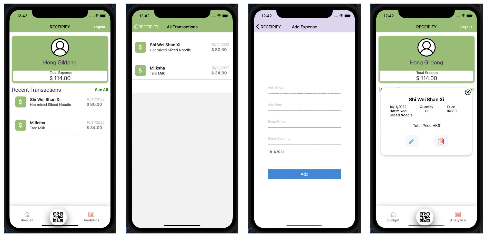

# Receipify with React Native

## Snapshot

## Project Setup

### Initial Setup

> Guide modified & updated according to our needs

    # Clone the application
    $ git clone https://github.com/tasniaishrar/comp3330_group_project.git

    # Install dependencies
    $ npm install
        or
    $ expo install

    # Update expo SDK version to 44
    $ expo upgrade 44

    # Run application
    $ npm start
        or
    $ expo start

### 2. Email / Password Authentication

- Goto Authentication tab left side of your project Dashboard
- Enable [Email / Password Authentication](https://firebase.google.com/docs/auth/web/password-auth) to your project

### 3. Database Setup

- Goto Firestore tab left side of your project Dashboard

- Create a **Firestore** database

### 4. Deployment

    # Login to Expo
    $ expo login

    # Run build
    $ expo build:android

    # Initialize your firebase project
    $ firebase init

    # Make sure to choose your package name
    # Make sure to choose your package apk
    # Follow the reaming steps
    # Download your android apk fro your expo dashboard
